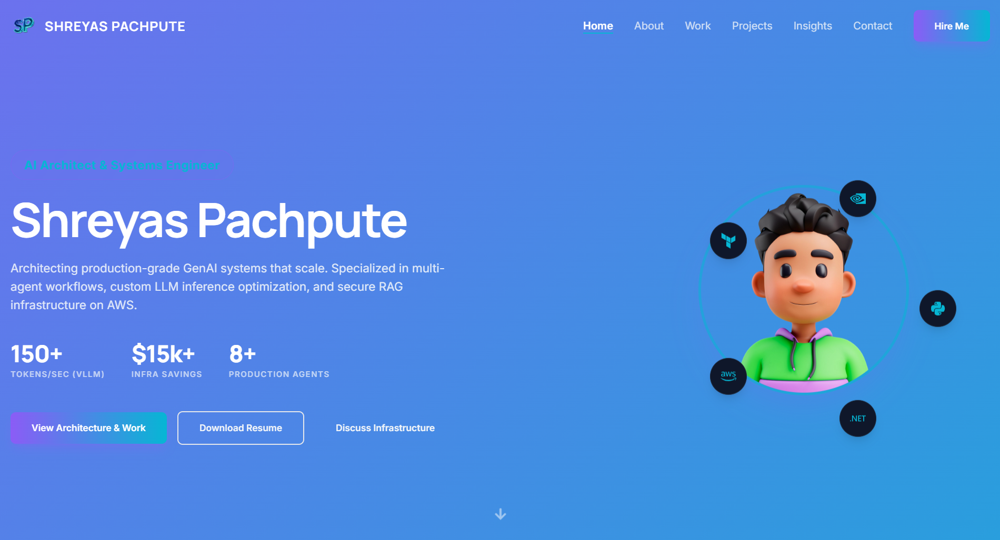

# AI Architect & GenAI Systems Engineer Portfolio




Welcome to the source code of my professional portfolio website. This site serves as a digital showcase of my work in **AI Architecture, RAG Systems, and Multi-Agent Workflows**. 

It is built with performance and SEO in mind, utilizing **Next.js 14** (App Router) for static site generation and hosted on **GitHub Pages**.

🔗 **Live Demo:** [shreyas-pachpute.github.io](https://shreyas-pachpute.github.io/)

---

## 🚀 Table of Contents

* [Overview](#-overview)
* [Key Features](#-key-features)
* [Tech Stack](#-tech-stack)
* [Installation & Setup](#-installation--setup)
* [Project Structure](#-project-structure)
* [Deployment](#-deployment)
* [Contact](#-contact)

---

## 🔍 Overview

This portfolio is designed to bridge the gap between enterprise software engineering and modern Generative AI. It moves beyond simple demos to showcase architectural decisions, system designs, and production metrics (latency, throughput, cost savings).

**Core Content Areas:**
1.  **Work:** Detailed case studies of deployed systems (RAG, Agents, vLLM).
2.  **Insights:** Technical blogs regarding system design and AI challenges.
3.  **Projects:** A repository of proof-of-concepts and open-source contributions.

---

## ✨ Key Features

*   **Modern Architecture:** Built on Next.js 14 using the App Router and React Server Components.
*   **High Performance:** Statically exported (`output: 'export'`) for lightning-fast load times on edge networks.
*   **Interactive UI:** Smooth animations and page transitions powered by **Framer Motion**.
*   **Responsive Design:** Fully responsive styling using **Tailwind CSS**, optimized for all device sizes.
*   **Glassmorphism Aesthetic:** Modern dark-mode UI with "glass" cards, gradients, and mesh effects.
*   **Working Contact Form:** Integrated with **Formspree** for serverless email handling.

---

## 🛠 Tech Stack

| Category | Technology |
| :--- | :--- |
| **Framework** | Next.js 14 (React 18) |
| **Styling** | Tailwind CSS |
| **Animations** | Framer Motion |
| **Typography** | Manrope, Inter, JetBrains Mono |
| **Icons** | React Icons (FontAwesome, SimpleIcons) |
| **Deployment** | GitHub Actions (CI/CD) -> GitHub Pages |
| **Package Manager** | NPM |

---

## 🏗 Installation & Setup

Follow these steps to run the project locally on your machine.

### 1. Prerequisites
*   Node.js (v18 or higher)
*   npm or yarn

### 2. Clone the Repository
```bash
git clone https://github.com/shreyas-pachpute/shreyas-pachpute.github.io.git
cd shreyas-pachpute.github.io
```

### 3. Install Dependencies
```bash
npm install
```

### 4. Run Development Server
```bash
npm run dev
```
Open [http://localhost:3000](http://localhost:3000) in your browser.

---

## 📂 Project Structure

```bash
.
├── public/              # Static assets (images, resumes, favicons)
├── src/
│   ├── app/             # Next.js App Router pages
│   │   ├── (pages)/     # Route groups (about, work, insights, etc.)
│   │   ├── layout.jsx   # Root layout (Header/Footer)
│   │   └── page.jsx     # Home page
│   ├── components/      # Reusable UI components
│   │   ├── 1_atoms/     # Buttons, badges
│   │   ├── 2_molecules/ # Cards, lists
│   │   ├── 3_organisms/ # Header, Footer, Forms
│   │   └── 4_sections/  # Page-specific sections
│   └── constants/       # Text content (Data Layer)
├── next.config.mjs      # Next.js configuration (Static Export)
├── tailwind.config.js   # Tailwind theme configuration
└── ...
```

---

## 🚀 Deployment

This project uses **GitHub Actions** for continuous deployment. 

**How it works:**
1.  Pushing code to the `main` branch triggers the workflow (`.github/workflows/deploy.yml`).
2.  GitHub Actions installs dependencies and builds the static site (`npm run build`).
3.  Next.js exports the HTML/CSS/JS to the `out/` directory.
4.  The artifact is deployed to the `gh-pages` environment automatically.

**To trigger a deployment manually:**
Simply push a commit to `main`.

```bash
git add .
git commit -m "Update content"
git push origin main
```

---

## 📬 Contact

I am actively seeking opportunities as a **Senior AI Engineer** or **AI Architect**.

*   **LinkedIn:** [linkedin.com/in/shreyaspachpute](https://www.linkedin.com/in/shreyaspachpute/)
*   **Email:** [shreyaspachpute1107@gmail.com](mailto:shreyaspachpute1107@gmail.com)
*   **GitHub:** [github.com/shreyas-pachpute](https://github.com/shreyas-pachpute)

---

*Designed & Built by Shreyas Pachpute © 2025*