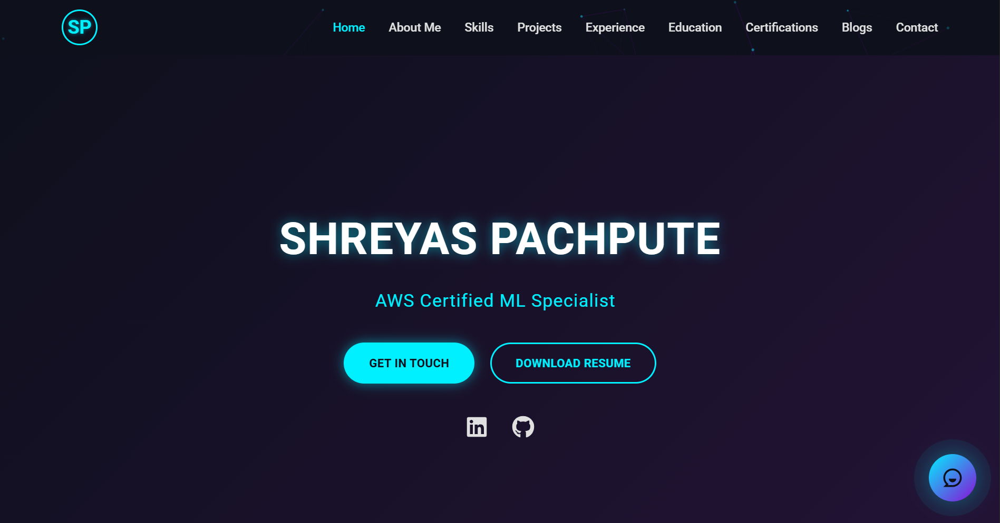

# AI Engineer Portfolio



Welcome to my personal portfolio website showcasing my work, projects, and expertise as an AI Engineer.

---

## 🚀 Table of Contents

* [About Me](#about-me)
* [Features](#features)
* [Demo](#demo)
* [Tech Stack](#tech-stack)
* [Getting Started](#getting-started)

  * [Prerequisites](#prerequisites)
  * [Installation](#installation)
  * [Running Locally](#running-locally)
* [Deployment](#deployment)
* [Project Structure](#project-structure)
* [Contributing](#contributing)
* [License](#license)
* [Contact](#contact)

---

## 🔍 About Me

I am an AI Engineer with a passion for building intelligent applications and solutions. Through this portfolio, I share my journey, projects, and technical expertise in machine learning, deep learning, and AI-driven web applications.

---

## ✨ Features

* **Homepage:** A dynamic introduction with animated backgrounds and smooth transitions.
* **Projects:** Interactive cards highlighting AI projects with live demos and links to GitHub repositories.
* **Experience:** Timeline of work experience and education.
* **Blog/Articles:** Section for technical articles and write-ups.
* **Contact Form:** Get in touch via a fully functional contact form.
* **Responsive Design:** Optimized for mobile, tablet, and desktop.

---

## 🎥 Demo

Check out the live site: [shreyas-pachpute.github.io](https://shreyas-pachpute.github.io/)

---

## 🛠️ Tech Stack

* **Frontend:** React, React Router, Framer Motion
* **Backend:** FastAPI
* **AI/ML:** TensorFlow\.js, Hugging Face Inference API
* **Deployment:** Render
* **CI/CD:** GitHub Actions

---

## 🏗️ Getting Started

Follow these instructions to get a local copy up and running.

### Prerequisites

* Node.js (>= 14.x)
* npm or yarn

### Installation

1. Clone the repo:

   ```bash
   git clone https://github.com/shreyas-pachpute/shreyas-pachpute.github.io.git
   ```
2. Install dependencies:

   ```bash
   npm install
   # or
   yarn install
   ```

### Running Locally

Start the development server:

```bash
npm start
# or
yarn start
```

Open [http://localhost:5500](http://localhost:5500/) to view it in the browser.

---

## 🚀 Deployment

This site is configured for easy deployment:

* Build:

  ```bash
  npm run build
  # or
  yarn build
  ```
* Deploy the `build/` directory to your hosting platform (Vercel, Netlify).

---

---

## 🤝 Contributing

Contributions are welcome! Please open an issue or submit a pull request:

1. Fork the project
2. Create your feature branch (`git checkout -b feature/AmazingFeature`)
3. Commit your changes (`git commit -m 'Add some AmazingFeature'`)
4. Push to the branch (`git push origin feature/AmazingFeature`)
5. Open a Pull Request

---

## 📄 License

Distributed under the MIT License. See `LICENSE` for more information.

---

## 📬 Contact

* **Name:** Shreyas Pachpute
* **Email:** [shreyaspachpute1107@gmail.com](mailto:shreyaspachpute1107@gmail.com)
* **LinkedIn:** [linkedin.com/in/shreyaspachpute](https://www.linkedin.com/in/shreyaspachpute/)

Feel free to reach out for collaborations or just a friendly hello!
